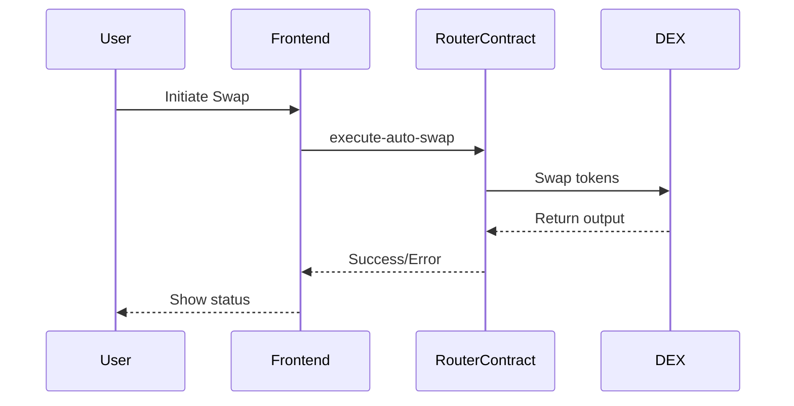

# Diagram Guidelines

To maintain clarity and consistency in project diagrams, follow these best practices:

## Tools
- Use [Mermaid](https://mermaid-js.github.io/) for quick diagrams (supported in GitHub markdown)
- For complex diagrams, use [draw.io](https://app.diagrams.net/), Figma, or Lucidchart
- Export diagrams as PNG or SVG for inclusion in docs

## Types of Diagrams
- **Architecture Overview**: High-level system components
- **Contract Flow**: Sequence of contract calls
- **Frontend Flow**: User interaction and state transitions
- **Deployment Pipeline**: CI/CD and deployment steps
- **Data Flow**: How data moves between frontend, contracts, and APIs

## Naming Conventions
- Use lowercase, hyphen-separated filenames (e.g., `architecture-overview.png`)
- Place all diagrams in `docs/diagrams/`

## Example Mermaid Diagram


## How to Add Diagrams
1. Create diagram in tool of choice
2. Export as PNG/SVG or copy Mermaid code
3. Save to `docs/diagrams/`
4. Reference in markdown docs:
   ```md
   
   ```
   or
   ```md
   ```mermaid
   ...
   ```
   ```

## Tips
- Keep diagrams simple and focused
- Use consistent colors and shapes
- Label all components clearly
- Update diagrams as codebase evolves

---

For questions, contact the project maintainers.
